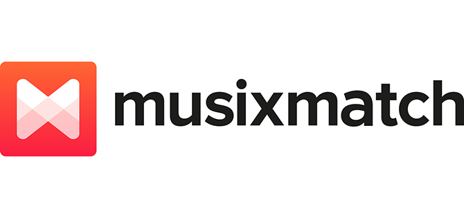

# Python Musixmatch

Simple integrate of API musixmatch.com with python

[](https://travis-ci.org/hudsonbrendon/python-musixmatch)
[](https://github.com/hudsonbrendon/python-musixmatch/issues?sort=updated&state=open)




# Quick start

```bash
$ pip install pymusixmatch
```
or

```bash
$ python setup.py install
```

# Authentication

Register for an API key:

All you need to do is [register](https://developer.musixmatch.com/signup) in order to get your API key, a mandatory parameter for most of our API calls. It’s your personal identifier and should be kept secret.

# Usage

With your key in hand, it's time to authenticate, so run:

```python
>>> from musixmatch import Musixmatch

>>> musixmatch = Musixmatch('<apikey>')
```

## Chart Artists Get

This api provides you the list of the top artists of a given country.

Parameters:

- country - A valid country code (default US).
- page - Define the page number for paginated results.
- page_size - Define the page size for paginated results (range 1 - 100).
- format - Decide the output type json or xml (default json).

```python
>>> musixmatch.chart_artists_get(1, 1)
```

## Chart Tracks Get

This api provides you the list of the top songs of a given country.

Parameters:

- page - Define the page number for paginated results.
- page_size - Define the page size for paginated results (range 1 - 100).
- f_has_lyrics - When set, filter only contents with lyrics.
- country - A valid country code (default US).
- format - Decide the output type json or xml (default json).

```python
>>> musixmatch.chart_tracks_get(1, 1)
```

## Chart Tracks Get

Search for track in our database.

Parameters:

- q_track - The song title
- q_artist - The song artist
- q_lyrics - Any word in the lyrics
- f_artist_id - When set, filter by this artist id
- f_music_genre_id - When set, filter by this music category id
- f_lyrics_language - Filter by the lyrics language (en,it,..)
- f_has_lyrics - When set, filter only contents with lyrics
- f_track_release_group_first_release_date_min - When set, filter the tracks with release date newer than value, format is YYYYMMDD
- f_track_release_group_first_release_date_max - When set, filter the tracks with release date older than value, format is YYYYMMDD
- s_artist_rating - Sort by our popularity index for artists (asc|desc)
- s_track_rating - Sort by our popularity index for tracks (asc|desc)
- quorum_factor - Search only a part of the given query string.Allowed range is (0.1 – 0.9)
- page - Define the page number for paginated results
- page_size - Define the page size for paginated results. Range is 1 to 100.
- callback - jsonp callback
- format - Decide the output type (json or xml)

```python
>>> musixmatch.track_search(q_artist='twentyonepilots', page_size=10, page=1, s_track_rating='desc')
```

## Track Get

Get a track info from our database: title, artist, instrumental flag and cover art.

Parameters:

- track_id - The musiXmatch track id.
- commontrack_id - The musiXmatch commontrack id.
- track_isrc - A valid ISRC identifier.
- track_mbid - The musicbrainz recording id.
- format - Decide the output type json or xml (default json).


```python
>>> musixmatch.track_get(15445219)
```

## Track Lyrics Get

Get the lyrics of a track.

Parameters:

- track_id - The musiXmatch track id.
- track_mbid - The musicbrainz recording id.
- format - Decide the output type json or xml (default json).


```python
>>> musixmatch.track_lyrics_get(15953433)
```

# Features

- [x] [Chart Artists Get](https://developer.musixmatch.com/documentation/api-reference/artist-chart-get)
- [x] [Chart Track Get](https://developer.musixmatch.com/documentation/api-reference/track-chart-get)
- [x] [Track Search](https://developer.musixmatch.com/documentation/api-reference/track-search)
- [x] [Track Get](https://developer.musixmatch.com/documentation/api-reference/track-get)
- [x] [Track Lyrics Get](https://developer.musixmatch.com/documentation/api-reference/track-lyrics-get)
- [ ] [Track Snippet Get](https://developer.musixmatch.com/documentation/api-reference/track-snippet-get)
- [ ] [Track Subtitle Get](https://developer.musixmatch.com/documentation/api-reference/track-subtitle-get)
- [ ] [Track Richsync Get](https://developer.musixmatch.com/documentation/api-reference/track-richsync-get)
- [ ] [Track Lyrics Post](https://developer.musixmatch.com/documentation/api-reference/track-lyrics-post)
- [ ] [Track Lyrics Feedback Post](https://developer.musixmatch.com/documentation/api-reference/track-lyrics-feedback-post)
- [ ] [Matcher Lyrics Get](https://developer.musixmatch.com/documentation/api-reference/matcher-lyrics-get)
- [ ] [Matcher Lyrics Get](https://developer.musixmatch.com/documentation/api-reference/matcher-lyrics-get)
- [ ] [Matcher Track Get](https://developer.musixmatch.com/documentation/api-reference/matcher-track-get)
- [ ] [Matcher Subtitle Get](https://developer.musixmatch.com/documentation/api-reference/matcher-subtitle-get)
- [ ] [Artist Get](https://developer.musixmatch.com/documentation/api-reference/artist-get)
- [ ] [Artist Search](https://developer.musixmatch.com/documentation/api-reference/artist-search)
- [ ] [Artist Albums Get](https://developer.musixmatch.com/documentation/api-reference/artist-albums-get)
- [ ] [Artist Related Get](https://developer.musixmatch.com/documentation/api-reference/artist-related-get)
- [ ] [Album Get](https://developer.musixmatch.com/documentation/api-reference/album-get)
- [ ] [Album Tracks Get](https://developer.musixmatch.com/documentation/api-reference/album-tracks-get)
- [ ] [Tracking Url Get](https://developer.musixmatch.com/documentation/api-reference/tracking-url-get)
- [ ] [Catalogue Dump Get](https://developer.musixmatch.com/documentation/api-reference/catalogue-dump-get)

# Dependencies
- Python 3.5
- [Pipenv](https://github.com/kennethreitz/pipenv)
- [requests](http://docs.python-requests.org/en/latest/)

# License
[MIT](http://en.wikipedia.org/wiki/MIT_License)
